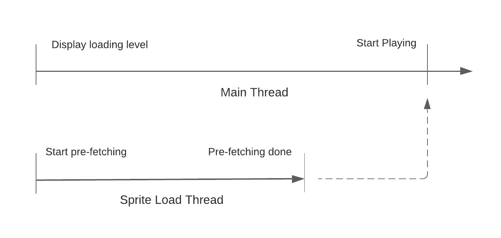
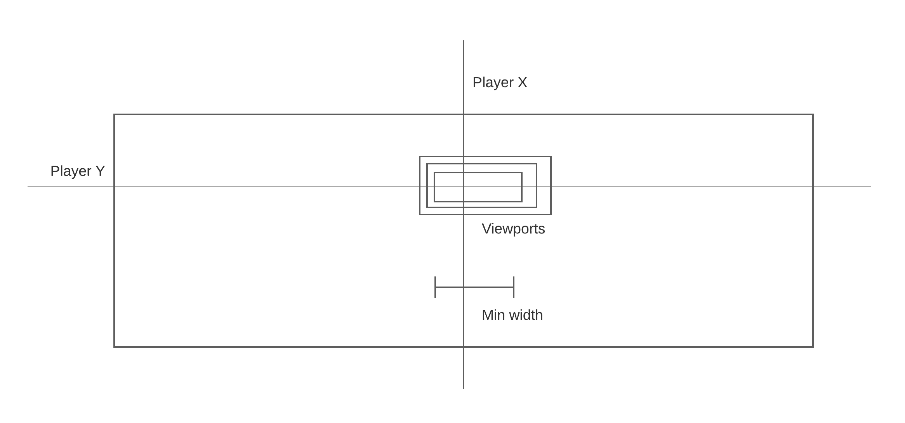
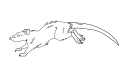
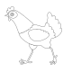
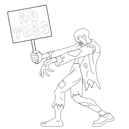

# Overview

Trippin on Tubs is an endless runner side-scrolling platformer.

The game is build upon the [Simple DirectMedia Layer](https://www.libsdl.org/) library,
that provides graphics and media facilities. 

Game art is developed in Inkscape and rasterized using Inkscape CLI invoked from
custom Python tools.


# Dependencies

Building:
* C++17+
* CMake
* SDL2 library
* SDL2_image library
* SDL2_mixer library
* SDL2_net library
* Nlohmann JSON library

Testing:
* Catch2 library

Assets:
* Inkscape
* Python 3.7+

# Building

The CMake build system generator is used for this project.

CMake files use [FetchContent](https://cmake.org/cmake/help/latest/module/FetchContent.html) exclusively.
The dependencies above do _not_ need to be installed as system libraries.
Dependencies are downloaded and compiled from source.

Review the GitHub actions [steps](.github/workflows/build.yml) to see complete build steps.

```shell
cmake -S. -B build
cmake --build build
```

# Fonts

A custom TrueType font called [Meltdown MF Font](https://www.fontspace.com/meltdown-mf-font-f5817)
is used in various places within the game. It was obtained from fontspace.com under a freeware license.


# Modules

The diagram below outlines the various game modules and the interdependencies.

All modules are separate static libraries linked with the final Trippin on Tubs binary executable.
The dependencies are encoded in the [CMakeLists.txt](src/CMakeLists.txt) file.

```
                       +----------+         +----------+
                       |          |         |          |
         +------------>|  Sprite  +-------->|  Engine  |
         |             |          |         |          |
         |             +----------+         +----------+
    +----+-----+
    |          |
    |   Game   |
    |          |
    +----+-----+
         |             +----------+         +----------+
         |             |          |         |          |
         +------------>|    UI    +-------->|   Net    |
                       |          |         |          |
                       +----------+         +----------+
```

# Media

Raw game assets are SVG images. SVGs are processed and sprite frames are rasterized
into PNG images. Trippin on Tubs loads PNGs with the help of SDL_Image and libpng.

PNGs are rasterized at multiple scales tailored for different devices and screen resolutions.

The diagram below outlines the flow of data between media components.


# Image Pre-Loading

Large sprites can take a measurable amount of time to load. The level that appears on launch
has relatively few objects and does not include the largest sprites. This represents an opportunity for
pre-fetching large images. When the game launches, large sprites are loaded in a background thread
while the auto-play loading level initializes and appears to the user. 
When the user chooses to begin the game, large images will have been pre-fetched.

The [SpriteLoadTask](src/sprite/SpriteLoadTask.h) class is responsible for background loading.



# Timing

Two independent timers drive game progress. First, the render rate is the
frequency at which game assets are rendered. The render rate is
synchronized with the display refresh rate, typically 60 Hz. Second, the engine
tick rate is the frequency with which the physical properties of game objects
are updated, typically 120 Hz.

The frame rendering thread and the physics engine 
thread communicate via a [scene builder](src/game/SceneBuilder.h) where shared state is held.
At the end of each engine clock cycle, a collection of immutable
draw functions is added to the staging area that represents a
scene snapshot in time.

During each render clock cycle, the render thread
takes the latest sample from the scene builder and invokes 
the immutable draw functions to display the scene.


# Camera

Game elements are arranged in maps that are much larger than displays. A camera models the
portion of the screen that is currently visible. The camera is anchored to the player
character. Vertically, the camera is centered on the player with half of the camera area
above the player and half below. Horizontally, the camera is aimed just to the right of the
player such that a quarter of the viewport area resides to the left of the player and three quarters
to the right.


# Scale

One of the guiding principle for Trippin on Tubs is that raster images should never be scaled or resized.
All scaling occurs with vector graphics during image preparation noted [above](#media).

Accordingly, a target scale is determined when the game launches and images are displayed at
their native resolution.

During game initialization, available scales are considered from largest to smallest until a minimum width
threshold is satisfied. That is, the scale used is the largest scale available that meets the minimum viewport
width requirement for that scale.

The scale chosen is used for _all_ types of graphics loaded throughout the game.

As noted [below](#camera), the camera is anchored on the player character. The visible area within a level
varies for different devices and displays.



# Simulation

Trippin on Tubs gameplay unfolds like a simulation. 
Game object locations and [activation rules](#object-activation) are fixed 
and [game engine](#engine) physics and movement rules govern interactions.
The game engine thread runs at a [fixed rate](#timing) on a dedicated thread
regardless of host device or platform. As a result, the game unfolds in a
consistent, predictable way across devices.

# Parallax

A parallax scrolling effect is achieved by mapping the camera viewport on to
corresponding regions of different layers of graphics. The viewport pans
across each layer proportionally, anchored to the player character.

Consider a level with a foreground layer of width _N_ and a background layer
of width _N/2_ The viewport will pan across the background layer at half
the speed of the foreground layer. A background layer of width _N/4_ would 
scroll at a quarter of the speed.


# Object Activation

The goal of the game object activation system in Trippin on Tubs is to minimize the number of 
active objects at a given time. This is achieved using a simple, proximity-based
activation method tailored for side-scrolling, single-direction gameplay. Objects are activated when 
they approach the viewport and are subsequently deactivated when they leave the viewport behind.
The end result is sparsely activated objects within a level. 

A level is composed of game objects described in a map JSON file. _All_ games objects are created
when a level is loaded and destroyed when a level ends. Once created, game object references are handed 
to the engine and the engine handles the lifecycle of each game object. The main thread also retains 
a reference for rendering objects. See [Timing](#timing) section for information on coordination between threads.

```text
+----------+         +--------+         +---------+
|          |         |        |         |         |
| INACTIVE +-------->| ACTIVE +-------->| EXPIRED |
|          |         |        |         |         |
+----------+         +--------+         +---------+
```

The tasks outlined in the [Engine](#engine) section only apply to objects in the active state.
That is, inactive and expired objects are not considered for position updates, collision detection, etc.
During each engine tick, game objects determine whether they ought to transition from one state to the next.

The decision about transitioning to or from the active state is based on proximity to the viewport. 
A default proximity is defined for all objects but proximity can also be configured for each object. 
In some cases, a cluster of objects should activate at the same tick to achieve a desired visual effect. 
The object-level activation proximity ought to be used in this case.


# Remote Logging

Noteable events that occur during game play are captured and sent to
the Trippin on Tubs server via HTTP API endpoint.

Events are game state changes such as menu selections, training start, game start, and level completion.
Events include details such as version, display resolution, display refresh rate, and frame rate.

Every event sent from a particular launch of the game includes a globally unique
app ID and a monotonically increasing log counter starting with 1.
The app ID is generated when the game is initialized as follows:

```
T{unix-epoch-seconds}N{random-int}
```

Absolutely no personal information or identifying device information
is ever obtained by the game or sent to the server.

The high score server is a [Python program](server/logger_lambda_function.py)
that is deployed as an AWS Lambda Function attached to the CloudFront distribution
for www.trippinontubs.com.

Logs are stored in an Amazon DynamoDB table.

Log entries are organized in the table under a single universal partition
to facilitate linear streaming over the data using local secondary indexes.

The sort key is a composition of the app ID and the log counter described above.
Together, they form a globally unique identifier for each individual log entry.

```
{app-id}/{counter}
```

```
POST /logs

{
  "id": "T1690735947N5135802/1",
  "index": 1,
  "message": "op=state_change, prev=TITLE, next=START_MENU"
}
```

# High Scores

At the end of each game, the player is given the option to enter a name
to record a high score entry. When a name is an entered, a background
thread immediately attempts to send the score entered to the
high score server.

The high score server is a [Python program](server/lambda_function.py)
that is deployed as an AWS Lambda Function attached to a CloudFront distribution
for www.trippinontubs.com.

High scores are stored in an Amazon DynamoDB table.

Scores are organized in the database by major game version.
The table partition key column is an integer named `version`.

The sort key is a globally unique identifier for the game play.
It is the application ID followed by the game ID.

Local secondary indexes are defined for (1) score and (2) day, score
to enable top-score and top-score-today searches.

Another pair of secondary indexes is defined without events in the projection.
These indexes are tailored for score listings without events, such as
on the trippinontubs.com [website](#website).

```
POST /scores

{
  "id": "T1656642743N42",
  "game": 1,
  "version": 0,
  "name": "EDB",
  "score": 1500,
  "events": [[{"t": 500, "e": 4}]]
}
```

```
GET /scores/alltime
```

```
GET /scores/today
```

# Website

www.trippinontubs.com is the official game website.
The website content is in this [repo](site), including the landing page
[index.html](site/index.html).

It includes various game-related links and a high score page [highscores.html](site/highscores.html).
The in-game high scores are also visible on this page.

The high scores page is powered by the same API endpoints used in-game.

# Screen Shake

The screen shake system in Trippin on Tubs was inspired by an excellent
[blog post](https://jonny.morrill.me/en/blog/gamedev-how-to-implement-a-camera-shake-effect/) by Johnny Morrill.

A screen shake consists of a number of discrete camera movement targets
that dampen linearly over time.

To start, random weights in the interval [-1.0, 1.0] are calculated for X and Y
directions for each discrete step. Then, at a given game engine clock tick,
an _effective_ weight is calculated based on linear interpolation between those
calculated steps. Finally, the effective weight is dampened by a factor from 1.0 to 0
based on the shake progress.

That final value is added to the camera to produce a shake or vibrate effect.

# Health Bar

Every baddie has a number of hit points. When the player collides
with a baddie, a health bar is briefly displayed showing current hit
points.

The health bar provides an indication of the life remaining after a collision.

The health bar is the only visual effect drawn programmatically
and not with static image asset.

# Strobe Effect

When the player collides with a baddie such as a zombie or a rat,
a strobe effect timer is started that lasts for 400 milliseconds.
During that period, the baddie animation alternates between normal
frames and frames with a white fill, such as those shown below.
This produces a simple strobe effect without the use of a rendering
pipeline or shaders. 





# Engine
The `trippin` physics engine handles the movement and interaction of all objects.
The footprint of an object is represented with an axis aligned bounding box (AABB)
that consists of top-left corner floating point numbers (x, y) and 
side length positive integers (w, h).  

## Engine Ticks

The engine operates on discrete steps called ticks. At each tick, the engine
performs six tasks:
1. Position updates
2. Grid snapping
3. Intersection detection 
4. Object snapping 
5. Collision detection
6. Collision reaction

### Update Position
During the update stage of an engine tick, motion-related updates are applied 
to each object. This includes acceleration, velocity, gravity, and friction. Updates
to these quantities are _discrete_, not continuous. Objects teleport from one
location to the next during each tick. No effort is made to examine the space
between consecutive positions for interactions.


## Grid Snapping

Object AABB intersections are calculated using discrete integer values.
Object AABBs are _snapped_ to the coordinate grid prior to intersection checks.
Snapping is accomplished by rounding the position floating point numbers (x, y).
This is done only for the purpose of intersection detection and object snapping - 
objects retain their _true_ floating positions as well.


### Intersection Detection

After object positions have been updated, some AABBs may intersect. 
Intersections are calculated based upon grid-snapped AABBs.


### Object Snapping 
The engine performs an object snapping procedure to separate intersecting objects such 
that the AABBs are touching but not intersecting.


When two intersecting objects are snapped, one of the objects acts as a platform and is 
immovable while the other moves off of the overlapping area. The object that 
moves is translated on the axis of least displacement. In the example above, `A`
is a platform and `B` is a movable object. It moves along the x axis
since the overlap is only 1 unit in that direction.

Object snapping proceeds in priority order. First, objects are snapped to actual
platforms. Then, objects are snapped to objects touching platforms. Then objects
are snapped to those objects and so on. The effect is a breadth-first application
of snapping that radiates away from platforms.

 

#### Unresolvable Intersections
The simple object snapping procedure isn't always able to remove all intersections. 

In the example below, `A` is a platform and it has the highest priority. 
It is processed first. Snapping cascades out to `B`, `C`, `D`, and `E`.
Finally, `E` overlaps with `A`. Since `A` is an immovable platform, it
cannot snap to `E`, leaving the conflict unresolved.


Unresolvable intersections can also arise from snap reactions that cascade into each
other. In the example below, `A` and `D` are platforms. Consequently, `B` snaps to `A`
and `C` snaps to `D`. That leaves a new intersection between `B` and `C`. If `B` snaps to
`C` an intersection with platform `A` would result.


### Collision Detection

Once intersection detection and object snapping are done, collision detection is 
quite straightforward. A collision occurs when two grid-snapped AABBs share a portion
of their perimeter. In other words, when they are touching.


There are several special cases in which touching objects are not considered to be
colliding.

One such case is an irrational collision. An irrational collision is a collision
that is attributed entirely to object snapping rather than object motion. In the
example below, `A` and `B` are moving south but a collision occurs on the x-axis
due to object snapping.


Another case is a redundant collision. A redundant collision occurs when the reaction
to an initial collision doesn't create enough distance to avoid a second collision
in the subsequent tick after grid snapping. The example below demonstrates that
problem.

  

### Collision Reaction

Collision reactions can be divided into two categories:
1. Object-platform
2. Object-object

Object-platform collision reactions can be further subdivided:
1. Absorbent - Object velocity is 0 on the axis of collision
2. Reflective - Object velocity direction changes on the axis of collision

Object-object collisions reaction can be further subdivided:
1. 1D elastic - Energy-conserving (non-dampening) collision along one axis 
2. 2D elastic - Energy-conserving (non-dampening) collision along vector between bounding box centers
3. 2D inelastic - Non energy-conserving (dampening) collision along vector between bounding box centers

C code for calculating elastic collision velocity vectors was obtained from 
[http://www.plasmaphysics.org.uk/collision2d.htm](http://www.plasmaphysics.org.uk/collision2d.htm).