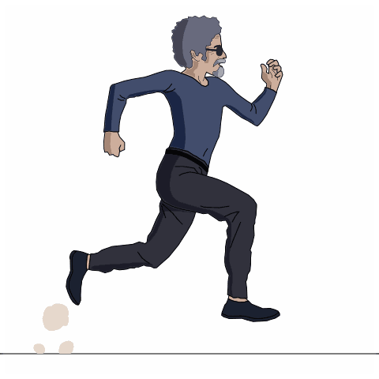
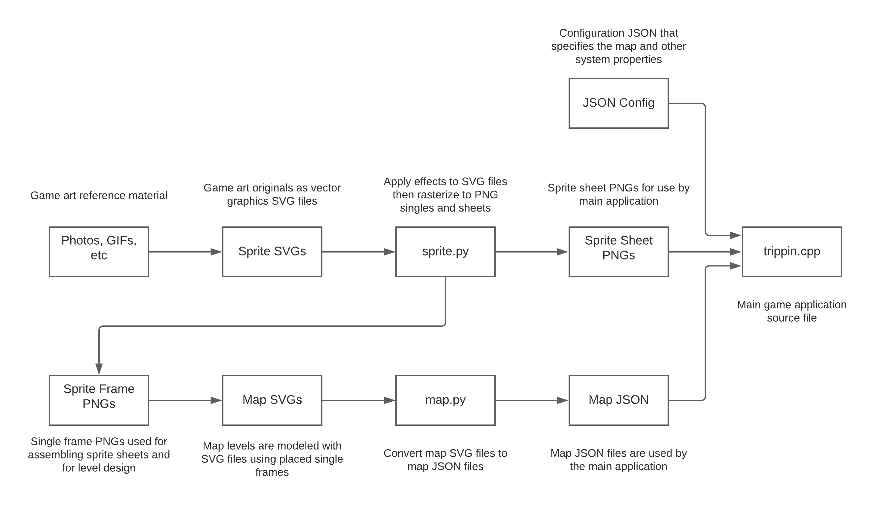
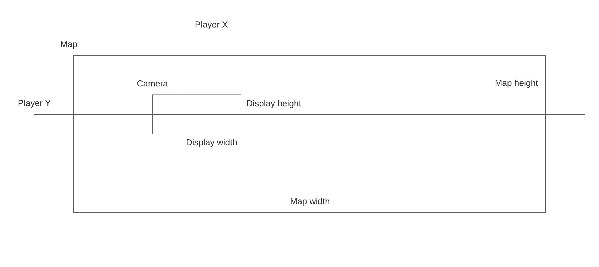
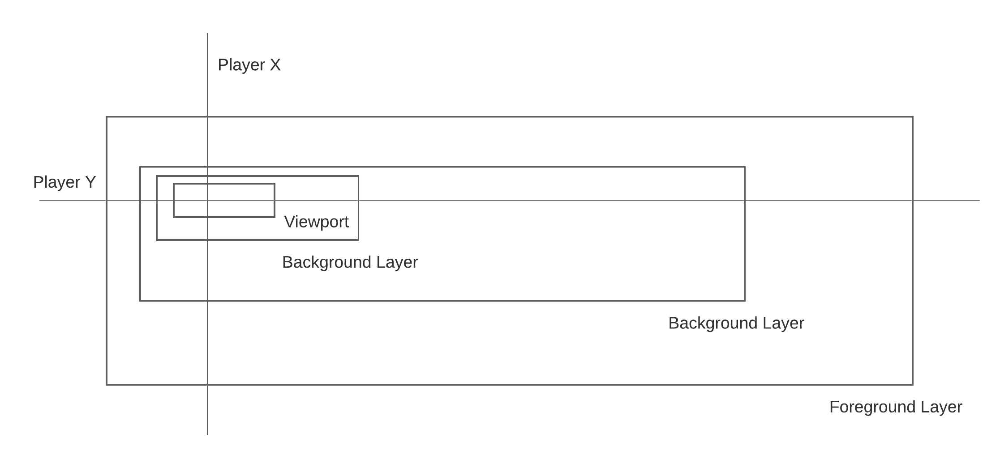
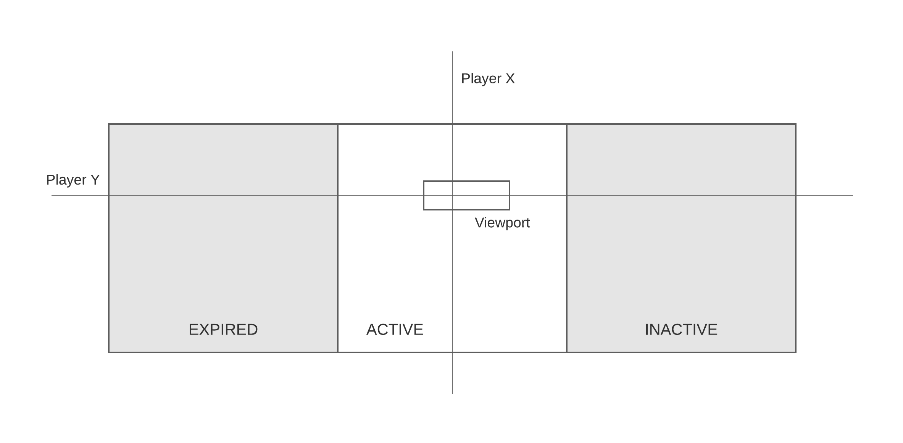

# Overview

Trippin on Tubs is an endless runner side-scrolling platformer.

The game is build upon the [Simple DirectMedia Layer](https://www.libsdl.org/) library,
that provides graphics and media facilities. 

Game art is developed in Inkscape and rasterized using Inkscape CLI invoked from
custom Python tools. Sprite sheets are assembled using the [Pillow](https://pillow.readthedocs.io/en/stable/) image processing
library also via custom Python tools.



# Dependencies

Building:
* C++17+
* CMake
* SDL2 library
* SDL2_image library
* SDL2_mixer library
* SDL2_net library
* Nlohmann JSON library

Testing:
* Catch2 library
* SDL2_tff library

Assets:
* Inkscape
* Python 3.7+
* Pillow image processing Python library

# Building

The CMake build system generator is used for this project.

SDL2, Catch2, and nlohmann_json rely on CMake modules that are locatable by the CMake `find_package()`. See the CMake [find_package documentation](https://cmake.org/cmake/help/latest/command/find_package.html) for details.

SDL2_image, SDL2_tff, SDL2_net, and SDL2_mixer ship with `pkg-config` files and rely on the CMake [FindPkgConfig](https://cmake.org/cmake/help/latest/module/FindPkgConfig.html) module.

Note that this [homebrew](https://brew.sh/) packages provide the necessary `.cmake` or `.pc` for these dependencies.

The project should successfully build with the following shell command when run from the project root directory:

    $ mkdir build && cd build && cmake ../ && make

# Fonts

A custom TrueType font called [Meltdown MF Font](https://www.fontspace.com/meltdown-mf-font-f5817)
is used in various places within the game. It was obtained from fontspace.com under a freeware license.


# Media

Raw game assets are SVG images. SVGs are processed and rasterized
into sprite sheet PNG images. Trippin on Tubs loads PNGs with the help of SDL_Image and libpng.

PNGs are rasterized at multiple scales tailored for different devices and screen resolutions.

The diagram below outlines the flow of data between media components.



# Scale

# Timing

Two independent timers drive game progress. First, the render rate is the
frequency with which game assets are rendered. The render rate is
synchronized with the display refresh rate, typically 60 Hz. Second, the engine
tick rate is the frequency with which the physical properties of game objects
are updated, typically 100 Hz. The frame rendering thread and the physics engine 
thread communicate via a shared channel. Object position data is communicated from
the engine thread to the rendering thread. User input is communicated in the opposite
direction.


# Camera

Game elements are arranged in maps that are much larger than displays. A camera models the
portion of the screen that is currently visible. The camera is anchored to the player
character. Vertically, the camera is centered on the player with half of the camera area
above the player and half below. Horizontally, the camera is aimed just to the right of the
player such that a third of the camera area resides to the left of the player and two thirds
to the right.



# Parallax

A parallax scrolling effect is achieved by mapping the camera viewport on to
corresponding regions of different layers of graphics. The viewport pans
across each layer proportionally, anchored to the player character.

Consider a level with a foreground layer of width _N_ and a background layer
of width _N/2_ The viewport will pan across the background layer at half
the speed of the foreground layer. A background layer of width _N/4_ would 
scroll at a quarter of the speed.




# Object Activation

The goal of the game object activation system in Trippin on Tubs is to minimize the number of 
active objects at a given time. This is achieved using a simple, proximity-based
activation method tailored for side-scrolling, single-direction gameplay. Objects are activated when 
they approach the viewport and are subsequently deactivated when they leave the viewport behind.
The end result is sparsely activated objects within a level. 

A level is composed of game objects described in a map JSON file. _All_ games objects are created
when a level is loaded and destroyed when a level ends. Once created, game object references are handed 
to the engine and the engine handles the lifecycle of each game object. The main thread also retains 
a reference for rendering objects. See [Timing](#timing) section for information on coordination between threads.

```text
+----------+         +--------+         +---------+
|          |         |        |         |         |
| INACTIVE +-------->| ACTIVE +-------->| EXPIRED |
|          |         |        |         |         |
+----------+         +--------+         +---------+
```

The tasks outlined in the [Engine](#engine) section only apply to objects in the active state.
That is, inactive and expired objects are not considered for position updates, collision detection, etc.
During each engine tick, game objects determine whether they ought to transition from one state to the next.

The decision about transitioning to or from the active state is based on proximity to the viewport. 
A default proximity is defined for all objects but proximity can also be configured for each object. 
In some cases, a cluster of objects should activate at the same tick to achieve a desired visual effect. 
The object-level activation proximity ought to be used in this case.



# Image Pre-Loading

# Modules

# Engine
The `trippin` physics engine handles the movement and interaction of all objects.
The footprint of an object is represented with an axis aligned bounding box (AABB)
that consists of top-left corner floating point numbers (x, y) and 
side length positive integers (w, h).  

## Engine Ticks

The engine operates on discrete steps called ticks. At each tick, the engine
performs six tasks:
1. Position updates
2. Grid snapping
3. Intersection detection 
4. Object snapping 
5. Collision detection
6. Collision reaction

### Update Position
During the update stage of an engine tick, motion-related updates are applied 
to each object. This includes acceleration, velocity, gravity, and friction. Updates
to these quantities are _discrete_, not continuous. Objects teleport from one
location to the next during each tick. No effort is made to examine the space
between consecutive positions for interactions.


## Grid Snapping

Object AABB intersections are calculated using discrete integer values.
Object AABBs are _snapped_ to the coordinate grid prior to intersection checks.
Snapping is accomplished by rounding the position floating point numbers (x, y).
This is done only for the purpose of intersection detection and object snapping - 
objects retain their _true_ floating positions as well.


### Intersection Detection

After object positions have been updated, some AABBs may intersect. 
Intersections are calculated based upon grid-snapped AABBs.


### Object Snapping 
The engine performs an object snapping procedure to separate intersecting objects such 
that the AABBs are touching but not intersecting.


When two intersecting objects are snapped, one of the objects acts as a platform and is 
immovable while the other moves off of the overlapping area. The object that 
moves is translated on the axis of least displacement. In the example above, `A`
is a platform and `B` is a movable object. It moves along the x axis
since the overlap is only 1 unit in that direction.

Object snapping proceeds in priority order. First, objects are snapped to actual
platforms. Then, objects are snapped to objects touching platforms. Then objects
are snapped to those objects and so on. The effect is a breadth-first application
of snapping that radiates away from platforms.

 

#### Unresolvable Intersections
The simple object snapping procedure isn't always able to remove all intersections. 

In the example below, `A` is a platform and it has the highest priority. 
It is processed first. Snapping cascades out to `B`, `C`, `D`, and `E`.
Finally, `E` overlaps with `A`. Since `A` is an immovable platform, it
cannot snap to `E`, leaving the conflict unresolved.


Unresolvable intersections can also arise from snap reactions that cascade into each
other. In the example below, `A` and `D` are platforms. Consequently, `B` snaps to `A`
and `C` snaps to `D`. That leaves a new intersection between `B` and `C`. If `B` snaps to
`C` an intersection with platform `A` would result.


### Collision Detection

Once intersection detection and object snapping are done, collision detection is 
quite straightforward. A collision occurs when two grid-snapped AABBs share a portion
of their perimeter. In other words, when they are touching.


There are several special cases in which touching objects are not considered to be
colliding.

One such case is an irrational collision. An irrational collision is a collision
that is attributed entirely to object snapping rather than object motion. In the
example below, `A` and `B` are moving south but a collision occurs on the x-axis
due to object snapping.


Another case is a redundant collision. A redundant collision occurs when the reaction
to an initial collision doesn't create enough distance to avoid a second collision
in the subsequent tick after grid snapping. The example below demonstrates that
problem.

  

### Collision Reaction

Collision reactions can be divided into two categories:
1. Object-platform
2. Object-object

Object-platform collision reactions can be further subdivided:
1. Absorbent - Object velocity is 0 on the axis of collision
2. Reflective - Object velocity direction changes on the axis of collision

Object-object collisions reaction can be further subdivided:
1. 1D elastic - Energy-conserving (non-dampening) collision along one axis 
2. 2D elastic - Energy-conserving (non-dampening) collision along vector between bounding box centers
3. 2D inelastic - Non energy-conserving (dampening) collision along vector between bounding box centers

C code for calculating elastic collision velocity vectors was obtained from 
[http://www.plasmaphysics.org.uk/collision2d.htm](http://www.plasmaphysics.org.uk/collision2d.htm).